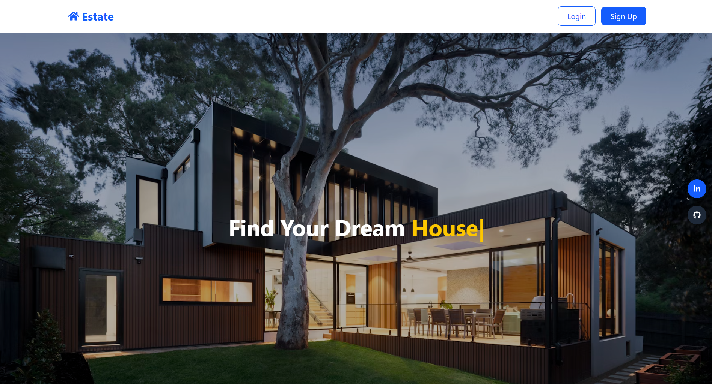
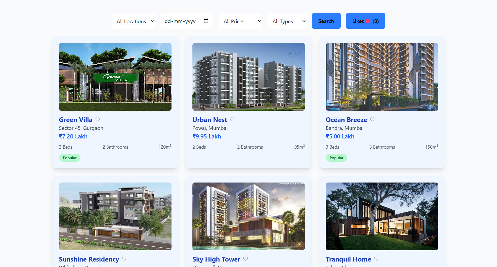
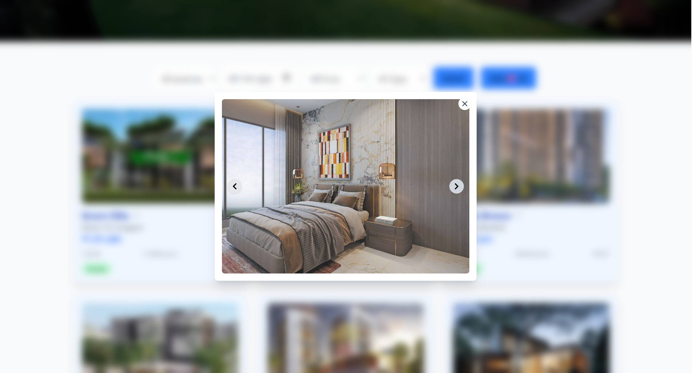

#  Estate

## Overview

**Estate** is a user-friendly web application that simplifies the process of finding rental properties. Users can explore listings based on filters like location, price range, and move-in date, ensuring a tailored and efficient search experience. Key features include property filtering, detailed listing views, and the ability to save favorite properties for quick access later.

The app allows users to:
- Search for properties using filters such as location, price, and property type.
- View detailed information for each listing in an intuitive layout.
- Mark properties as favorites to revisit them later.
- Open property images in a fullscreen modal for a better visual experience.

## Live Link

[View Estate live](https://estate-react.vercel.app/)

---

## Features

- **Property Search:**
  - Search properties by location, price range, move-in date, and property type.
  - Filter properties based on price range (e.g., ₹2 Lakh - ₹5 Lakh, ₹5 Lakh - ₹10 Lakh).
  - Filter by move-in date and other attributes.

- **Property Cards:**
  - Display properties in a card format with details like name, price, location, and size.
  - Each property card features an image carousel and a heart icon for marking it as a favorite.

- **Favorites:**
  - Users can click the heart icon to mark properties as their favorites.
  - View the list of favorite properties with an easy toggle between showing all properties and just favorites.

- **Full-Screen Modal:**
  - When clicking on a property image, a full-screen modal appears displaying all images with navigation arrows.

- **Responsive Design:**
  - Fully responsive for both desktop and mobile devices.

## Screenshots

### Landing Page with navbar

### Property Cards with filter section

### Modal

## Tech Stack

- **Frontend:** React.js
- **Styling:** Tailwind CSS
- **Icons:** React Icons
- **State Management:** React Hooks (`useState`, `useEffect`)

## Extra Packages Used

- **React Icons:** For using icons such as heart, GitHub, LinkedIn.
- **Tailwind CSS:** For utility-first CSS to style the application.
- **Custom Modal Implementation:** Used for displaying multiple images in a modal view.

## Learnings from the Project

- How to integrate React with responsive design using Tailwind CSS.
- Implementing dynamic filtering functionality with React hooks.
- Working with React components for displaying and managing UI elements such as property cards and modals.
- Managing state for favorites and search filters.
- Handling image modals and creating a smooth user experience for image viewing.

## Future Improvements

- **User Authentication:** Allow users to sign up/login and save their favorite properties permanently.
- **Backend Integration:** Integrate with a backend server or a database to fetch properties and save favorites.
- **Advanced Filtering:** Add more advanced filtering options like number of bathrooms, pets allowed, and more.
- **Pagination:** Implement pagination for property listings instead of displaying all properties at once.

Thank you for checking out the **Estate** project! Feel free to explore and contribute.
